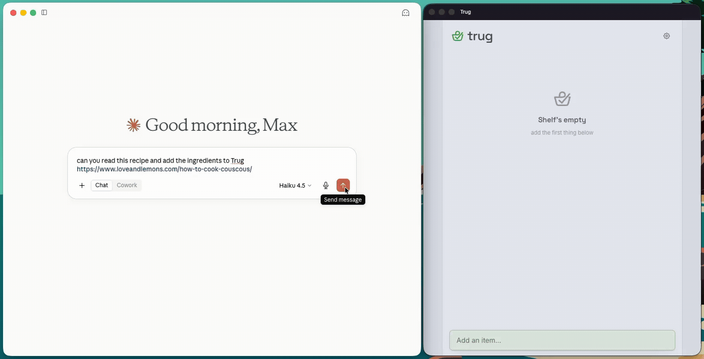
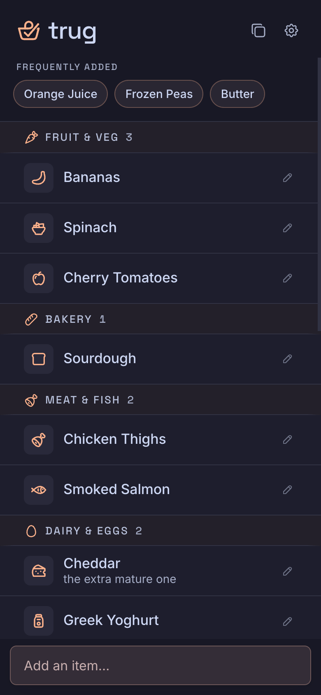
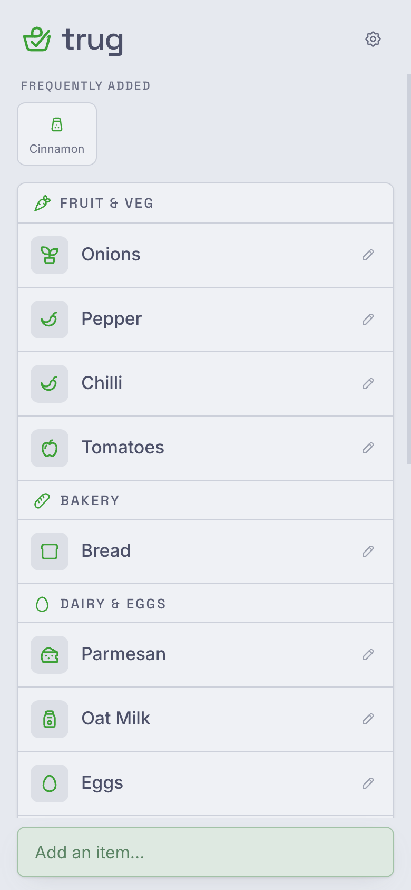
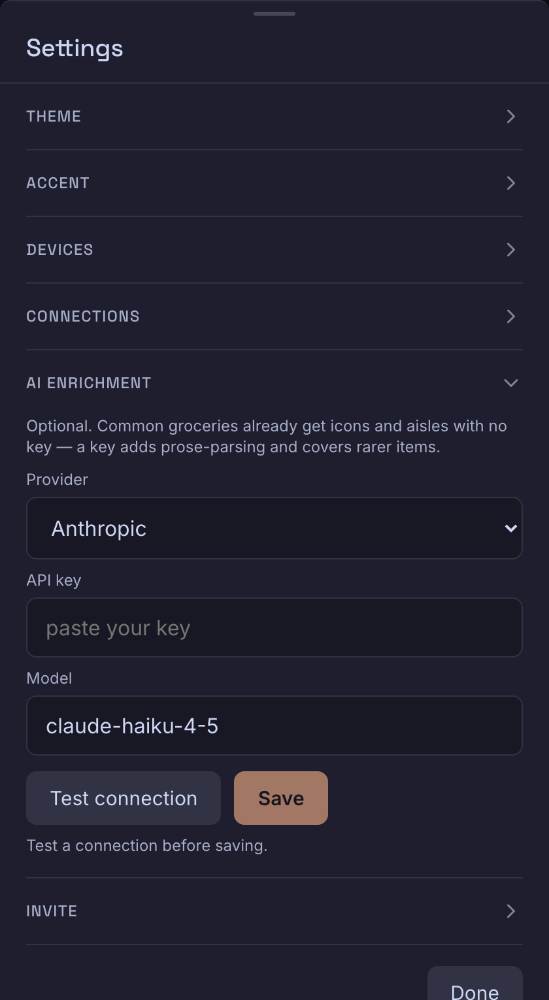
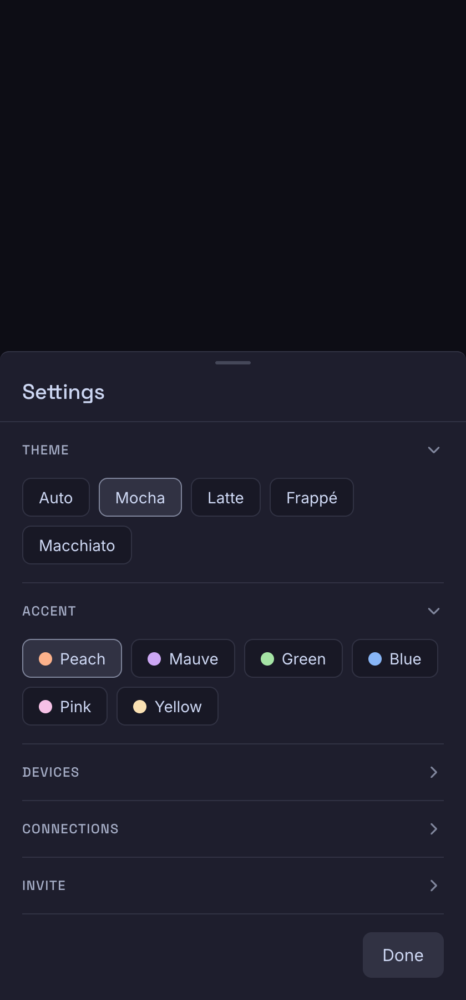

<p align="center">
  
</p>

<p align="center">
  <picture>
    <source media="(prefers-color-scheme: dark)" srcset="icon/trug-wordmark-dark.svg">
    
  </picture>
</p>

<p align="center">
  <a href="https://github.com/maxdraki/trug/actions/workflows/ci.yml"></a>
  <a href="https://github.com/maxdraki/trug/releases/latest"></a>
  <a href="https://github.com/maxdraki/trug/pkgs/container/trug"></a>
  <a href="LICENSE"></a>
</p>

A self-hosted shared shopping list for one household. A phone each, an installable PWA,
and a single SQLite file behind a FastAPI server — no cloud account, no subscription, no
third-party anything. Trug is fast where it counts: an optimistic, offline-first list you
can read and tick off in a shop with no signal, passkey sign-in so there are no passwords
to type at the door of a store, a voice-ring capture endpoint that drops "milk, eggs and
bread" straight onto the list, and an MCP server so Claude can read and edit the list for
you. It runs `docker compose up` to a working list in a few minutes and is happy on a
Raspberry Pi behind a Cloudflare Tunnel, on a Tailscale node, or on Railway.

<p align="center">
  
</p>

<p align="center"><em>Ask Claude to stock the list — it fills in live, iconed and sorted into aisles.</em></p>

<p align="center">
  
  &nbsp;&nbsp;
  
</p>


## Quickstart (self-host with Docker Compose)

From a clone to your household on their phones with passkeys:

1. **Clone and start it.**

   ```sh
   git clone https://github.com/maxdraki/trug.git
   cd trug
   docker compose up -d
   ```

   The first build compiles the Svelte PWA and the Python server into one image, then
   starts a single container serving everything on port `8000`. The container fixes the
   ownership of the `./data` volume itself on start-up (it runs as a pinned non-root user
   and `chown`s the mount via `gosu` before dropping privileges), so there is **no manual
   `chown` step** — Linux hosts, a Raspberry Pi, and Docker Desktop all just work.

   > **Docker Desktop users:** clone under your home directory (or add the clone's path to
   > Docker's Settings → Resources → File sharing), or the `./data` bind mount is denied.
   > Native Docker Engine and a Raspberry Pi are unaffected.

2. **Read the generated tokens from the logs.** With nothing pinned, Trug generates a
   one-time **bootstrap token** (for claiming the first account) plus two machine tokens,
   and prints them on boot:

   ```sh
   docker compose logs | grep -E 'TRUG_BOOTSTRAP_TOKEN|TRUG_TOKEN'
   ```

   You'll see three:

   | Token | Role |
   | --- | --- |
   | `TRUG_BOOTSTRAP_TOKEN` | **First-user claim** — use it once to create the very first account. It is one-time and first-user-only: it stops working the moment that account is claimed, and prints only while no account exists. |
   | `TRUG_TOKEN_RING` | **Machine key** for the voice ring / webhook (`/api/capture`). |
   | `TRUG_TOKEN_MCP` | **Machine key** for token-based MCP / automation clients. |

   There is **no household roster to configure** — no `TRUG_USERS`, no per-user tokens. The
   first person claims the instance, then invites everyone else by name from inside the app.

   **Every unpinned token regenerates on each restart** — the banner reprints on every boot
   while any token is still generated. So pin the machine keys *before* you rely on them.

3. **Configure your domain and pin the machine tokens — then restart once.** Copy the sample
   env and set your domain and the printed machine-token values:

   ```sh
   cp .env.example .env
   ```

   ```sh
   # REQUIRED for passkeys on a real domain — WebAuthn binds credentials to these:
   TRUG_RP_ID=trug.example.com          # bare host, no scheme, no port
   TRUG_ORIGIN=https://trug.example.com # full origin people actually visit

   # pin the machine keys so a restart doesn't log out the ring / MCP clients
   TRUG_TOKEN_RING=…
   TRUG_TOKEN_MCP=…
   # optional: pin a stable bootstrap token before the first claim
   # TRUG_BOOTSTRAP_TOKEN=…
   ```

   Then `docker compose up -d` to pick them up.
   **Just trying it on your laptop?** The built-in defaults (`TRUG_RP_ID=localhost`,
   `TRUG_ORIGIN=http://localhost:8000`) already satisfy WebAuthn — passkeys work on
   `localhost` with no config at all. You only need to set `TRUG_RP_ID`/`TRUG_ORIGIN` once
   you serve Trug on a real domain, and they must match the address in the browser or every
   passkey ceremony fails. (If you didn't pin the bootstrap token, re-read it from the logs
   after this restart before you claim, since the pre-restart value is now dead.)

4. **Check the configuration (and see your tokens).** Before you open the app, run the
   built-in doctor — it catches the silent killers (a `TRUG_RP_ID`/`TRUG_ORIGIN` that doesn't
   match the URL people load breaks every passkey ceremony with *no* error anywhere) and
   prints the current tokens, so you never have to grep the logs:

   ```sh
   docker compose exec trug trug-doctor
   ```

   It exits `0` healthy, `1` on warnings, `2` on errors, and every non-OK line says exactly
   what to change (add `--json` for a machine-readable report an agent can apply, or `--redact`
   to hide token values before pasting the output into an issue). Fix anything it flags before
   claiming your account.

5. **Claim the first account.** Open the `TRUG_ORIGIN` you set in step 3 (on your laptop
   with the defaults, that's `http://localhost:8000`), and on the sign-in gate choose
   **"use an access token"** — paste the **bootstrap token** once. Because no account exists
   yet, Trug switches to **"create the first account"**: type your name and create a passkey
   (Face ID / Touch ID / a security key). You're in, and the bootstrap token is now spent —
   it can never claim another account.

   > **Passkeys need HTTPS or literal `localhost`.** A browser only creates a passkey in a
   > secure context, and `TRUG_RP_ID` can't be an IP — so a plain-HTTP LAN address like
   > `http://192.168.x.x:8000` or `http://pi.local:8000` serves the list fine but **can't
   > enrol a passkey**, and the ceremony fails silently. Give the box a trusted HTTPS name
   > first (a tunnel, Tailscale Serve, or a reverse proxy) and set `TRUG_ORIGIN`/`TRUG_RP_ID`
   > to it — see [Deployment notes](#deployment-notes).

6. **Invite your household.** Signed in, open **Settings → Members → "+ invite someone"**,
   type a name (any new name — there's no fixed list), and share the generated link
   (single-use, expires in 24 hours). They open it on their phone, create a passkey, and
   they're in. Any enrolled member can invite others or remove members — it's a flat
   household, no admin tier. From then on everyone signs in with a passkey — no tokens, no
   passwords.

   Passkeys and the roster live in the database and survive restarts regardless — pinning
   (step 3) only keeps the *machine-token* values stable.

That's it — a working shared list, and no LLM key required (see [Bring your own
key](#bring-your-own-key-optional)).

## Railway

Trug runs on [Railway](https://railway.app) as a single service with one volume:

1. **Deploy from the repo.** New Project → Deploy from GitHub repo → pick your fork. Railway
   builds the `Dockerfile` as-is.
2. **Add a volume mounted at `/data`.** This is where `trug.db` lives; without it the list
   resets on every deploy. (The container `chown`s the volume on boot, so Railway's
   root-owned mount is handled for you.)
3. **Set the environment variables** on the service: `TRUG_RP_ID` and `TRUG_ORIGIN` for your
   domain (there's no `TRUG_USERS` — the roster is dynamic). Optionally pin
   `TRUG_TOKEN_RING` / `TRUG_TOKEN_MCP` and `TRUG_BOOTSTRAP_TOKEN`, and set the `LLM_*` keys.
4. **Use the generated domain.** Under Settings → Networking, generate a domain (e.g.
   `trug.up.railway.app`). **`TRUG_ORIGIN` must exactly match it** (`https://trug.up.railway.app`)
   and `TRUG_RP_ID` must be the bare host (`trug.up.railway.app`), or passkeys and the MCP
   OAuth flow won't line up with the URL people actually load.

Any token you don't pin is generated and printed in the deploy logs — on first boot and
again on every restart while it's unpinned (the banner reprints each time). Grab the
**bootstrap token** from the logs, claim the first account, and invite your household from
Settings → Members. Pin `TRUG_TOKEN_RING` / `TRUG_TOKEN_MCP` so a redeploy doesn't rotate
them out from under the ring and MCP clients.

## Passkeys, in one line

There are no passwords and no accounts to manage. A one-time **bootstrap token** claims the
first account (name + passkey); everyone else joins by opening a one-time **invite link**
(Settings → Members → "+ invite someone") and creating a passkey. Manage members and your
signed-in devices under **Settings** (revoke any session; remove any member — except the
last one). If you ever need the token fallback again — a browser with no passkey support,
say — the gate's "use an access token" link is always there.

> **Recovery note:** the bootstrap token is first-user-only, but you never edit the SQLite file
> by hand. Anyone with host access runs the built-in recovery CLI — host access *is* the
> recovery credential: `docker compose exec trug trug-doctor recover --invite NAME` mints an
> invite link with no session needed (the primary escape hatch, preserves all data), and for a
> *total* lockout `… recover --reset-bootstrap` non-destructively re-opens the first-user claim.

## Connect AI assistants (MCP)

Trug ships an MCP (Model Context Protocol) server at `/mcp`, so Claude can read and edit the
list directly ("what's on the shopping list?", "add oat milk").

- **claude.ai, Claude Desktop, or Claude Code — custom connector.** Add a connector and give
  it just the URL:

  ```
  https://your-domain/mcp
  ```

  Trug is its own OAuth 2.1 authorization server, so there's nothing else to configure: you
  sign in with your passkey and approve a short consent screen, and the connector is linked.
  No client id, no secret, no token to paste.

- **Token-based clients (including the Pebble ring).** Devices that can't do an interactive
  OAuth sign-in use the URL plus a bearer token: point them at `https://your-domain/mcp`
  with `Authorization: Bearer <MCP token>`. The live token is in **Settings → Connections**
  (or `TRUG_TOKEN_MCP`).

## Pebble ring (Index 01)

The Pebble voice ring drops items onto the list two ways. The exact, copy-pasteable values
live in **Settings → Connections** (both the URL and the token, with a reveal toggle) — but
here's the shape of each:

**Webhook route (transcription → list):**

| Field | Value |
| --- | --- |
| URL | `https://your-domain/api/capture` |
| Method / body | `POST`, `multipart/form-data` (transcription-only; audio parts are read and discarded) |
| Authorization | `Bearer <ring token>` (`TRUG_TOKEN_RING`, or Settings → Connections) |

The ring POSTs a `transcription` form field; Trug parses it into items and broadcasts them
to connected PWAs instantly over Server-Sent Events. An audio-only clip with no
transcription returns `200` and adds nothing (the ring retries on real failures, so a
transcription-less clip must never look like an error).

**MCP route (ring speaks MCP directly):**

| Field | Value |
| --- | --- |
| URL | `https://your-domain/mcp` |
| Transport | Streamable HTTP |
| Authorization | `Bearer <MCP token>` (`TRUG_TOKEN_MCP`, or Settings → Connections) |

The ring authenticates with a bearer token (it can't run the interactive OAuth flow), which
is why the static `TRUG_TOKEN_MCP` bearer stays valid alongside the OAuth path.

You can also drop a plain webhook onto `/api/capture` from anything else — the JSON shape
`{"text": "milk, eggs and bread"}` with the ring bearer works too:

```sh
curl -X POST https://your-domain/api/capture \
  -H "Authorization: Bearer $TRUG_TOKEN_RING" \
  -H "Content-Type: application/json" \
  -d '{"text": "milk, eggs and bread"}'
```

## Bring your own key (optional)

**Fully useful with no key; sharper with one.** Out of the box, a built-in (tier-0) icon
map means common groceries land already iconed and sorted into the right aisle — the list
looks and shops well with **no LLM key at all**, and the ring's capture endpoint falls back
to a heuristic splitter (commas, newlines, and the word "and"). Add a key and Trug also
untangles natural-language prose into clean items and covers the rarer things the built-in
map doesn't know.

**Configure it in Settings, or via env.** The easiest path is in-app: sign in, open
**Settings → AI enrichment**, pick a provider (Anthropic · Google Gemini · OpenAI · Ollama ·
Custom OpenAI-compatible), and paste a key. Then hit **Fetch models** — Trug queries your
provider for its live list of text-generation models and drops them into a dropdown, so you
pick a current model instead of guessing a stale id (you can still type one by hand for
anything not listed). Hit **Test connection** — it runs one real hello-world enrichment
(`milk → 🥛 Dairy & Eggs`) before you **Save**. The saved config takes effect immediately
(no redeploy) and overrides the env below; **Clear** reverts to the env/none. Only a signed-in
human can reach it, and the full key is never shown back — just a masked `••••1234` hint (nor
does the key ever appear in the fetched-model response or the server logs).

Prefer env? Set these in `.env` (all optional) as the startup default; a saved in-app config
still wins over them:

| Variable | Purpose |
| --- | --- |
| `LLM_API_KEY` | API key for your LLM provider. Enables enrichment when present. |
| `LLM_MODEL` | Model id (default: `claude-haiku-4-5`). |
| `LLM_BASE_URL` | Point Trug at an **OpenAI-compatible** endpoint. This switches the wire protocol, not just the host: any non-empty value makes Trug POST OpenAI-shaped bodies to `{base_url}/chat/completions` with `Authorization: Bearer`, instead of Anthropic's `x-api-key` + Messages API. The endpoint must speak the OpenAI protocol — an Anthropic-format proxy will fail. Example (Gemini): `https://generativelanguage.googleapis.com/v1beta/openai`. |
| `TRUG_SECRET` | Optional. When set, a key saved in-app is **encrypted at rest** (Fernet) in the SQLite DB. Without it, an in-app key is stored in plaintext — fine for a single-household self-host, but set this if the DB is backed up or shared. Keep it stable; rotating it makes existing saved keys unreadable. |

No key is ever baked into the image; enrichment is opt-in and degrades gracefully if the
provider is unavailable.

<p align="center">
  
</p>

## Features

Everything lives on one screen, grouped into store-order aisles. Settings tuck away into
collapsible sections — theme (Mocha/Latte and the rest of Catppuccin), accent colour,
your signed-in devices, invite links, and the connection details for AI assistants and the
ring:

<p align="center">
  
</p>

## Philosophy

Trug does one thing — make Saturday's shop faster for one household — and deliberately
refuses everything else. The non-goals (the deliberate event horizon):

- **No recipes, meal planning, or pantry inventory.** Those are a different product.
- **No passwords and no admin tiers.** A flat, invite-based passkey roster — no
  registration forms, no password resets, no owner/admin hierarchy.
- **No multi-tenancy.** One household per instance; nothing household-specific is baked into
  the code.
- **No native apps / Play Store.** Installable PWA only.
- **No price tracking, budgets, or store loyalty anything.**

Any feature request gets tested against: *"does this make Saturday's shop faster?"* If no →
parking lot.

## Deploy it with Claude Code

This repo ships a Claude Code **skill** that walks the whole self-host through for you. Clone
the repo, open Claude Code in it, and say **"deploy trug"** (or "set up my own trug"). The
`deploy-trug` skill (in [`.claude/skills/deploy-trug/`](.claude/skills/deploy-trug/SKILL.md))
collects your household names and domain, brings the stack up with Compose or Railway,
verifies the first boot, and mints the passkey invites — mirroring the Quickstart above.

## Backup

Everything lives in one SQLite file (WAL mode) in the `./data` volume, so backups are
trivial. Take a consistent, online snapshot with sqlite3's `.backup` — safe to run while the
container is live — and optionally push it offsite:

```sh
sqlite3 ./data/trug.db ".backup /backups/trug-$(date +%F).db"
# optional: sync offsite
rclone copy /backups/trug-$(date +%F).db gdrive:trug-backups
```

[`scripts/backup-sample.sh`](scripts/backup-sample.sh) wraps this up for a nightly cron job.
To restore, see [`docs/restore.md`](docs/restore.md).

## Upgrading

Your list, passkeys, and settings live in the `./data` volume, so they survive an upgrade — and
Trug runs any database migrations automatically on boot. Taking a [backup](#backup) first is
still a good habit.

**Using the published image** (recommended):

```sh
docker compose pull      # fetch the new image from GHCR
docker compose up -d     # recreate the container on it
```

**Building from source** (if you run the `build: .` path from a clone):

```sh
git pull
docker compose up -d --build
```

Then confirm it's healthy and see the current tokens/version:

```sh
docker compose exec trug trug-doctor
```

For reproducible upgrades, pin a version instead of `:latest` — set
`image: ghcr.io/maxdraki/trug:v0.1.1` (for example) in `docker-compose.yml` and bump it
deliberately. See the [releases](https://github.com/maxdraki/trug/releases) and
[CHANGELOG](CHANGELOG.md) for what each version changes.

On **Railway**, a connected repo redeploys automatically on push; otherwise hit **Deploy** on
the service.

## Deployment notes

Trug is one container and one SQLite file — it runs nicely on a Raspberry Pi. To reach it
from outside your network without forwarding ports, put it behind a **Cloudflare Tunnel**
(a commented-out `cloudflared` service is ready to uncomment in `docker-compose.yml`) or a
**Tailscale** node. Either way TLS is handled for you and no inbound firewall changes are
needed — and whichever public hostname you land on, set `TRUG_RP_ID`/`TRUG_ORIGIN` to match
it so passkeys and the MCP OAuth flow line up with the URL people actually load.

**HTTPS (or `localhost`) is a prerequisite for creating accounts, not a nice-to-have.**
A browser only creates a passkey in a secure context, and `TRUG_RP_ID` can't be an IP
address — so a Pi reached over plain `http://192.168.x.x:8000` or `http://pi.local:8000`
can serve the list, but a human **cannot** create or claim an account there. Give the box
a trusted HTTPS name first; two good options on a home box:

- **Tailscale Serve** — one command (`tailscale serve --bg 8000`) gives the Pi a trusted
  `https://<name>.ts.net` name, TLS and cert handled for you (easiest).
- **Cloudflare Tunnel** — the commented `cloudflared` block in `docker-compose.yml`.

Whichever you choose, set `TRUG_RP_ID`/`TRUG_ORIGIN` to that HTTPS name people actually
visit. See `docker-compose.yml` and `.env.example` for the details.

**Token fallback is machine / emergency access only — it does not replace HTTPS.** The
gate's "use an access token" path signs you in as a *machine principal*, not a human
owner: it does **not** create an owner account, and the session is heavily gated. Settings
→ **Members** (the only way to onboard people), **Connections**, **Devices**, and **AI
enrichment** all require a passkey/cookie session and return `401` on a bearer — and
there's no **Sign out**. Read the machine tokens from your `.env` or the first-boot banner
rather than from the UI. The list, capture, and MCP itself do work on a bearer, so this is
useful for machine access or an emergency reach-in — but the first real account still has
to be claimed over HTTPS (or literal `localhost`).

**Rate limiting.** Trug ships a basic in-process rate limiter on the sensitive auth
endpoints (bootstrap claim, passkey login/register, invite redemption, and the OAuth
`/oauth/token` endpoint) — enough to blunt brute force on a directly-exposed box. It is not a
replacement for a real edge limiter: put Trug behind a reverse proxy (Cloudflare, nginx,
Tailscale) for production-grade limiting, and keep it there even with Trug's limiter on.
The client IP the limiter keys on is chosen through an explicit trust boundary,
`TRUG_TRUSTED_PROXY_HOPS`:

- `0` (default — direct exposure / dev): `X-Forwarded-For` is ignored entirely and the
  socket peer is used. A client cannot forge a header to dodge the limit.
- `1` (behind one reverse proxy, e.g. Cloudflare / nginx / Tailscale): the address your
  proxy inserted is used, not the client-supplied leftmost value. Use `N` for `N` chained
  trusted proxies.

Because the default is `0`, a **proxied deployment must set `TRUG_TRUSTED_PROXY_HOPS`** to
the number of trusted hops — otherwise every request looks like it comes from the proxy and
shares one bucket. If your proxy already rate-limits, set `TRUG_RATE_LIMIT_ENABLED=false` to
turn Trug's limiter off.

**Prebuilt image.** On a tagged release, a multi-arch (`amd64` + `arm64`) image publishes
to GHCR at `ghcr.io/maxdraki/trug`. The compose file carries `image:
ghcr.io/maxdraki/trug:latest` alongside `build: .` — and because that `build:` section is
present, `docker compose up` **builds from source by default** (a multi-minute build on a
Pi). To use the prebuilt image instead — a ~30s pull, available once v0.1.0 is published to
GHCR — run `docker compose pull` first (or `docker compose up --pull always`). If the image
isn't there yet (before the first release, or for local changes), Compose builds from source
as usual. `docker compose build` (or `up --build`) always forces a from-source rebuild.

**Compose version.** The `env_file: [{ path, required }]` long form in `docker-compose.yml`
needs Compose **v2.24+** (Jan 2024). A box set up with Debian's `docker.io` plus a
standalone `docker-compose` v1 will hard-error on that key — install Docker's own apt repo
for a current Compose.

**Config file alternative.** Every setting shown here as an environment variable can also
come from a `config.yaml` in the working directory — `tokens`, `bootstrap_token`, `db_path`,
`rp_id`, `origin`, the `llm_*` keys, and the rest. Trug loads it on start-up, and environment
variables take precedence over `config.yaml` values. It's a convenient single-file
alternative to a long `.env` if you'd rather keep all configuration (tokens included) in one
YAML file.

## License

MIT — see [LICENSE](LICENSE). Copyright (c) 2026 Trug contributors.

## Credits

Trug is themed with [Catppuccin](https://github.com/catppuccin/palette), and
bundles [Tabler Icons](https://tabler.io/icons) and the
[Inter](https://github.com/rsms/inter) and
[Space Grotesk](https://github.com/floriankarsten/space-grotesk) typefaces. Full
license texts for the redistributed assets are in
[THIRD-PARTY-NOTICES.md](THIRD-PARTY-NOTICES.md).
